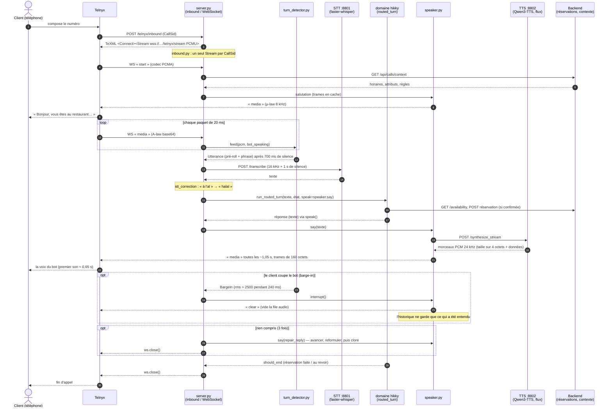
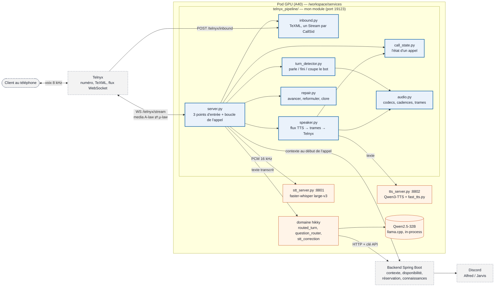
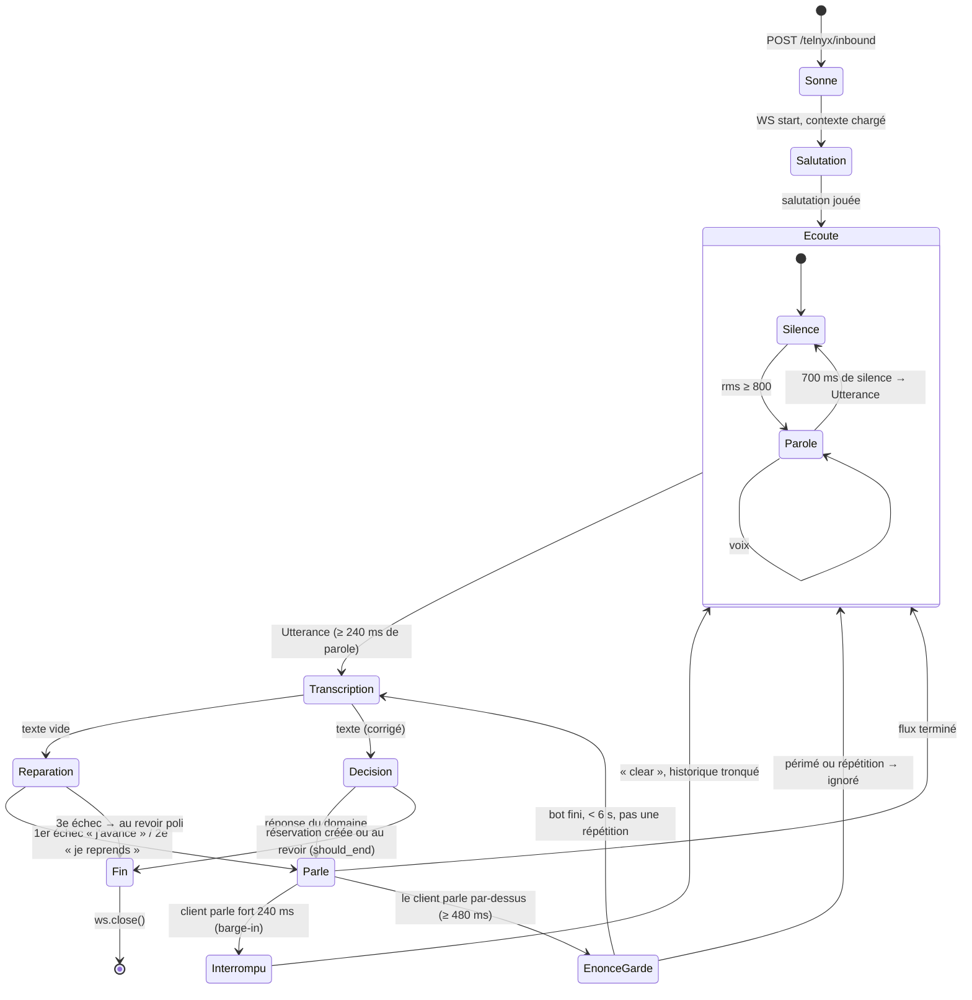

# Pipeline téléphonique temps réel — carte de lecture

Un client appelle le restaurant ; Telnyx nous passe sa voix par paquets de 20 ms ;
on écoute, on comprend, on répond en flux, et la réservation part au backend.
Trois diagrammes pour lire le code en dix minutes. Les frontières de **ce module**
sont en gras : ce qui entre, c'est la voix du client ; ce qui sort, c'est la voix du
bot et les appels aux services voisins (STT, TTS, LLM/domaine, backend).

## 1. Un appel, de bout en bout (séquence)

## 2. Les pièces et qui appelle qui (composants)

## 3. La vie d'un appel (états)

### Où est chaque constante
| Constante | Valeur | Fichier | Pourquoi |
|---|---|---|---|
| seuil de parole | 800 | `turn_detector.py` | bruit de ligne + marge, lu dans les logs |
| fin de phrase | 35 trames = 700 ms | `turn_detector.py` | 500 ms coupait 2 phrases sur 10 |
| parole minimale | 12 trames = 240 ms | `turn_detector.py` | filtre les blips, garde « oui » |
| barge-in | rms > 2500 pendant 12 trames | `turn_detector.py` | un « mmh » ne coupe pas le bot |
| pré-roll | 6 400 octets = 400 ms | `turn_detector.py` | la première syllabe n'est plus rognée |
| énoncé gardé périmé | 6 s | `call_state.py` | le client a déjà avancé |
| espacement des envois | 1,05 s | `speaker.py` | contrainte Telnyx (1 message/s) |
| trame | 160 octets µ-law = 20 ms | `audio.py` | protocole Telnyx |
| échecs avant clôture | 3 | `repair.py` | règle « 3 no-match → humain » |

### Configuration : tout vient de l'environnement (`config.py`)
Aucune adresse ni chemin n'est écrit dans le code : `Settings.from_env()` lit ces variables
au démarrage, et une variable obligatoire absente arrête le processus avec son nom.

| Variable | Défaut | Rôle |
|---|---|---|
| `PUBLIC_HOST` | **obligatoire** | hôte public du pod, mis dans le TeXML rendu à Telnyx |
| `HIKKY_BACK_BASE_URL` | **obligatoire** | URL du backend (réservations, base de connaissances) |
| `HIKKY_BACK_API_KEY` | vide | clé API du backend |
| `TTS_STREAM` | vide (= synthèse complète) | `1` = voix envoyée en flux |
| `HIKKY_STT_URL` | `http://127.0.0.1:8801/transcribe` | service de reconnaissance vocale |
| `HIKKY_TTS_URL` | `http://127.0.0.1:8802/synthesize` | synthèse complète (repli, salutation) |
| `HIKKY_TTS_STREAM_URL` | `http://127.0.0.1:8802/synthesize_stream` | synthèse en flux |
| `HIKKY_RESTAURANT_PHONE` | `+33472100100` | numéro du restaurant (identifie la session) |
| `HIKKY_LLM_GGUF` | `/workspace/models/Qwen2.5-32B-Instruct-Q5_K_M.gguf` | modèle de langue |
| `HIKKY_GREETING` | « Bonjour, vous êtes au restaurant Le Petit Sud, je vous écoute. » | première phrase |
| `HIKKY_DEBUG_DIR` | `/workspace/debug` | WAV de chaque énoncé ; vide = pas d'enregistrement |
| `HIKKY_SRC_DIRS` | `/workspace/Call-bot/src:/workspace/Call-bot/scripts` | où trouver `hikky` (séparés par `:`) |
| `HIKKY_ENV_FILE` | `/workspace/bot_back.env` | fichier `KEY=VALUE` chargé au démarrage, sans écraser l'existant |
| `HIKKY_TIMEZONE` | `Europe/Paris` | fuseau des dates dites au client |

Tests : `tests/unit/telnyx_pipeline/` (36 tests, sans réseau ni GPU).
